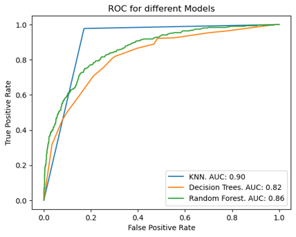
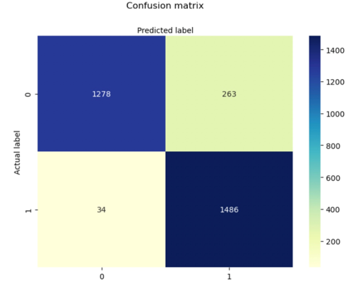

# Key Insight: People who are attractive, funny and have shared interests are seen as more desirable by potential partners

# Author
- Cameron Ezazi
- Benjamin Willett
- Tori Wright
- [Vinh Van](https://github.com/MorphingGrid)

## Table of Contents
- [Data Problem](#data-problem)
- [Dataset Source](#dataset-source)
- [Tech Stack](#tech-stack)
- [Methods](#methods)
- [Results](#results)

## Data Problem
The purpose of this study aims to determine the most desirable attributes in a person that people look for when searching for a potential partner, using popular Classification Models such as KNN, Decision Trees and Random Forest. This is done by figuring out which variables have the highest significance on the response variable match, a binary variable where 0-No Match and 1-Match. More than ever, people are connected to others through their electornics and smart phones, but the frequency of face to face interaction is on the downtrend, resulting in many feeling growing feelings of social anxiety and second guessing their social ability. This project aims to help classify what is seen as desirable in modern society to help people navigate the information age. 

## Dataset Source
[Speed Dating Dataset](https://www.kaggle.com/datasets/whenamancodes/speed-dating)  

## Tech Stack
- Jupyter Notebook 6.5.3 on Conda
- Packages include: numpy, pandas, sklearn, SMOTE, matplotlib, seaborn, graphviz, pydot

## Methods
- Data Exploration
- SMOTE for Imbalanced Classification
- KNN
- Decision Trees
- Random Forest
- Performance Validation

## Results  
ROC Curve of the Classification Models  
  
  

Top 3 models (by AUC)

| Model     	                | AUC 	|
|-------------------	        |------------------	|
| KNN     	                  | 90% 	            |
| Random Forest 	            | 86% 	            |
| Decision Trees         	    | 82% 	            |

Confusion Matrix for KNN  
  
  

Best Model: **KNN**  

- Based on our ROC Curve, the KNN model appeared to be the superior model. As the TPR(True Positive Rate) increases, the False Positive Rate large stays the same. This is good because it means our model overall is an accurately predicting Matches and Rejections based on the training data and is rarely misclassifying people, ie Matching someone that should have been rejected. 
