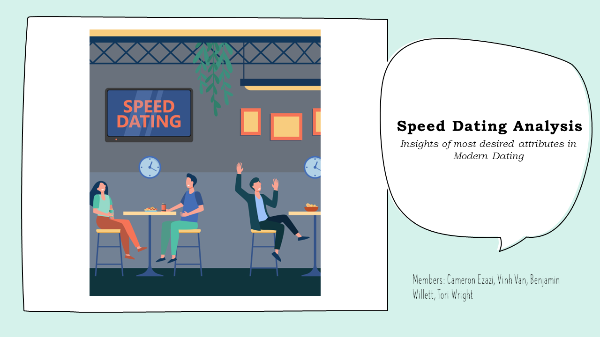

# Key Insight: People who are attractive, funny and have shared interests are seen as more desirable by potential partners

# Author
- Cameron Ezazi
- Benjamin Willett
- Tori Wright
- [Vinh Van](https://github.com/MorphingGrid)

## Table of Contents
- [Data Problem](#data-problem)
- [Dataset Source](#dataset-source)
- [Tech Stack](#tech-stack)
- [Methods](#methods)
- [Results](#results)
- [Lessons Learned](#lessons-learned)
- [What could be Improved](#what-could-be-improved)

## Data Problem
The purpose of this study aims to determine the most desirable attributes in a person that people look for when searching for a potential partner, using popular Classification Models such as KNN, Decision Trees and Random Forest. This is done by figuring out which variables have the highest significance on the response variable match, a binary variable where 0-No Match and 1-Match. More than ever, people are connected to others through their electornics and smart phones, but the frequency of face to face interaction is on the downtrend, resulting in many feeling growing feelings of social anxiety and second guessing their social ability. This project aims to help classify what is seen as desirable in modern society to help people navigate the information age. 

## Dataset Source
[Speed Dating Dataset](https://www.kaggle.com/datasets/whenamancodes/speed-dating)  

## Tech Stack
- Jupyter Notebook 6.5.3 on Conda
- Packages include: numpy, pandas, sklearn, SMOTE, matplotlib, seaborn, graphviz, pydot

## Methods
- Data Exploration
- SMOTE for Imbalanced Classification
- KNN
- Decision Trees
- Random Forest
- Feature Importance Analysis
- Performance Evaluation using ROC

## Results  
ROC Curve of the Classification Models  
  
  

Top 3 models (by AUC)

| Model     	                | AUC 	|
|-------------------	        |------------------	|
| KNN     	                  | 90% 	            |
| Random Forest 	            | 86% 	            |
| Decision Trees         	    | 82% 	            |

Confusion Matrix for KNN  
  
  

Best Model: **KNN**  

- Based on our ROC Curve, the KNN model appeared to be the superior model. As the TPR(True Positive Rate) increases, the False Positive Rate largely stays the same. This is good because it means our model overall is an accurately predicting Matches and Rejections based on the training data and is rarely misclassifying people, ie matching someone that should have been rejected.

- One thing to note is that because our KNN model is a 1NN model that each test point becomes its own region which can lead to overfitting. We chose to implement Decision Trees and Random Forest in an attempt to make our models more interpretable and a bit more robust to deal with an overfitted training data. Decision Trees and Random Forests also have access to a indicator variable in Python called "importance". Using Feature Importance Analysis, the significance of each attribute can be rated.

- Using Feature Importance Analysis, we found that a person's attractiveness, sense of humor and shared interests with a person had over a 50% impact on their chances of matching with another person!  

## Lessons Learned

-  Initially, our response variable was very imbalanced. There was a far larging amount of rejections in the training set than matches(it's tough out here). To fix this, we implemented Synthetic Minority Oversample Technique, or SMOTE, an alternative for bootstrapping to balance the response variable with an equal number of Matches to No Matches. This helps reduces overfitting as the rows are not complete duplicates, but synthetic instances

## What could be Improved  

-  Using Feature Importance Analysis, we found that many of the variable had very little importance or predictive power at all. Retraining the model or redoing the project after removing many of these predictors could yield better results.

- Many variables had to be dropped from the beginning due to high correlation. This was due to the fact that many variables were related to one another or often were linked with a 'primary key'. Combining the dataset with a Database management tool such as SQL and breaking the large csv into smaller quieries could lead to more fruitful results.

## Notebook
For a more indepth look at the actual code, the notebook can be found 
